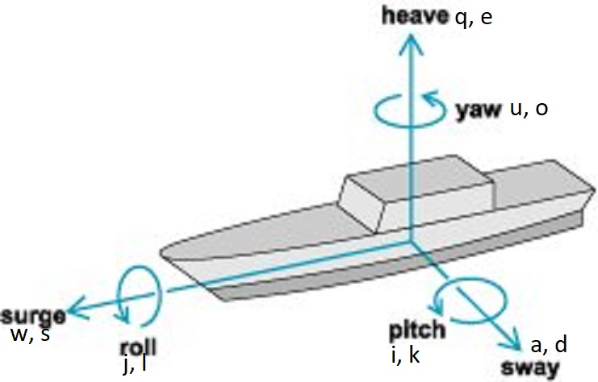

# CAP4053GameAI
 
This is a github for the team Space Aces in the spring 2022 offering of CAP 4053 - AI for game Programming. The basic concept of our game is that the player will control a space fighter capable of movement in 3 directions and rotation in 3 directions, making control optimal for twin stick setups since a normal flight stick has 3 axes (left/right, forward/back, and twist), or movement on the qweasd keys and uiojkl keys. See diagram:

 
A space dogfighter is an underrepresented genre in the game market. Many of the players of Star Citizen and Elite Dangerous are disgruntled with their games in various ways, mostly relating to parts of the game unrelated to spaceflight control. The drift mechanic in EA's Star Wars Squadrons was unpopular and unintuitive, and the game was made by EA which many players despise for that alone. Games like Arma and DCI world are very true to life which requires a lot of non combat gameplay which turns off many players in a similar, but ultimately different way than the aforementioned Star Citizen and Elite Dangerous. And finally, games like War Thunder are far too arcade like and removed from real world flight control to appeal to many players. This leaves a section of players who want a dogfighting game where they are actually piloting a fighter craft that moves like many expect a fighter craft to move. This is where our audience lies, and there is currently no game that appeals to this specific audience of players.
 
A space dogfighter is also a great environment to tinker with artificial players. We can try a variety of techniques to create agents of different skill so that we can provide a fulfilling opponent for the player to fight against.
